# Milestone 4: Continuous Integration and Continuous Delivery (Jenkins) 
## Objective   
1. Git Familiar with Jenkins.
2. Understand the pipeline syntax used by Jenkins.
3. Configure a continuous integration pipeline for a Jenkins job.
4. Configure a continuous deployment pipeline for a Jenkins job.
## Repository:   
[https://github.com/GeorgeDaoud3/SOFE3980U-Lab4.git](https://github.com/GeorgeDaoud3/SOFE3980U-Lab4.git) 

## Introduction and Getting started
1. Watch the following video about [Dev-ops](https://www.youtube.com/watch?v=LFDrDnKPOTg).
2. Install Jenkins Server on GCP, using Helm. Helm is a tool to create customized applications within Kubernetes.
   1. Watch the following video about [Helm](https://www.youtube.com/watch?v=fy8SHvNZGeE).
   2. If there is no Kubernetes cluster within your GCP project, Create a cluster as illustrated in [MS3](https://github.com/GeorgeDaoud3/SOFE3980U-Lab3#setup-google-kubernetes-engine-gke). To get the cluster information.
      ```cmd
      kubectl cluster-info
      ``` 
   3. Pull the Jenkins Helm chart from a repository.  
      ```cmd
      helm repo add jenkinsci https://charts.jenkins.io
      helm repo update
      ```
   4. Clone the repository for the Helm values.
      ```cmd
      cd ~
      git clone https://github.com/GeorgeDaoud3/SOFE3980U-Lab4.git
      ```
   5. Use the Helm CLI to deploy the chart **cd-jenkins** with the configuration set from the repository **jenkins/values.yaml** onto Kubernetes with the name **cd-jenkins**.
      ```cmd
      helm install cd-jenkins -f ~/SOFE3980U-Lab4/jenkins/values.yaml jenkinsci/jenkins --wait
      ```
   6. **(optional)** to remove the **cd-jenkins** from Kubernetes. **<ins>Don’t run it now</ins>**.
      ```cmd
      helm uninstall cd-jenkins
      ```
   7. Retrieve Jenkins external IP,
      ```cmd 
      kubectl get services
      ```
      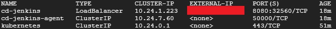
   8. Access Jenkins server using the following URL http://\<jenkinsIP\>:8080. Where \<jenkinsIP\> is the IP obtained in the previous step. It should look like
      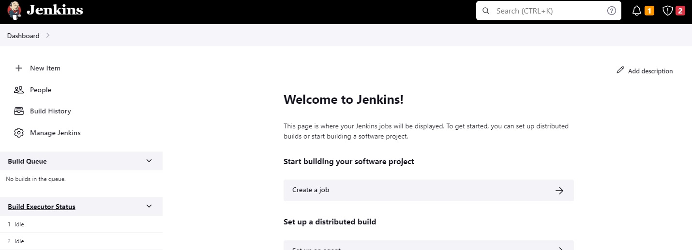
   9. To fix a connection issue, **Manage Jenkins**, select **configure Global Security**, under **CSRF Protection**, and check **Enable proxy compatibility**. Click **save** button. (Note the connection issue won’t be fixed until the configuration is saved. You may need to repeat this step until the configuration is saved)
      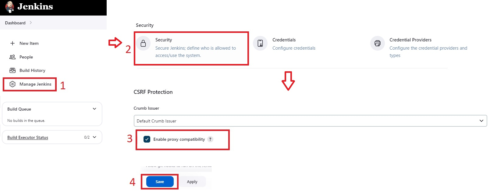
## Create a Maven project job
1. Create a GitHub account. Create a repository. Copy the content of the [repository](https://github.com/GeorgeDaoud3/SOFE3980U-Lab4.git) into your repository ( or simply fork it ).
2. Create a GitHub token: Within the GitHub page, login into your account. Choose  **settings**, **Developer settings**, **Personal access token**, then, **Token (classic)**. Click **Generate new token**. Select **Generate new token (classic)**. Set the note, check **public_repo** and click **Generate token**. Finally, copy the token code.
   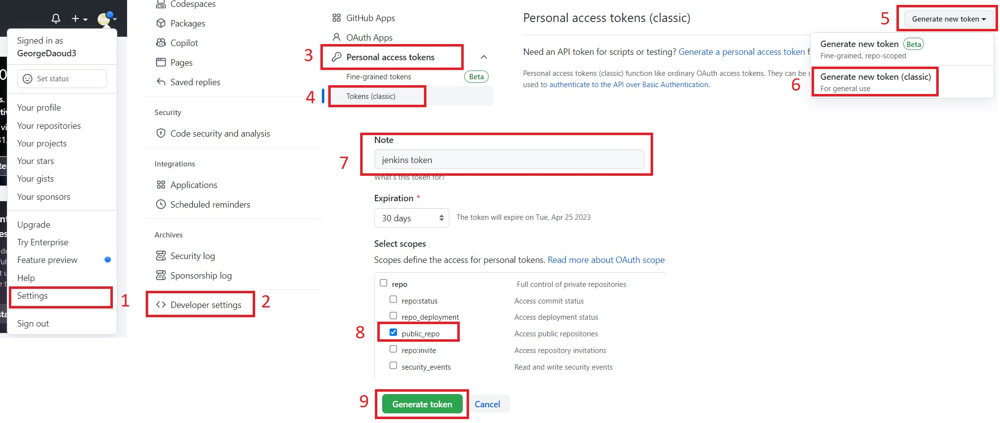
3. Install **Pipeline Maven Integration** Plugin: select **Dashboard**, **Manage Jenkins**, then, **Manage Plugins**. Choose **Available Plugins**. Search for **Pipeline Maven Integration**. After checking it, click **Download now and install after restart**. Check **Restart Jenkins when installation is complete and no jobs are running**. Finally, wait until the plugin is intalled and Jenkins restarts.
   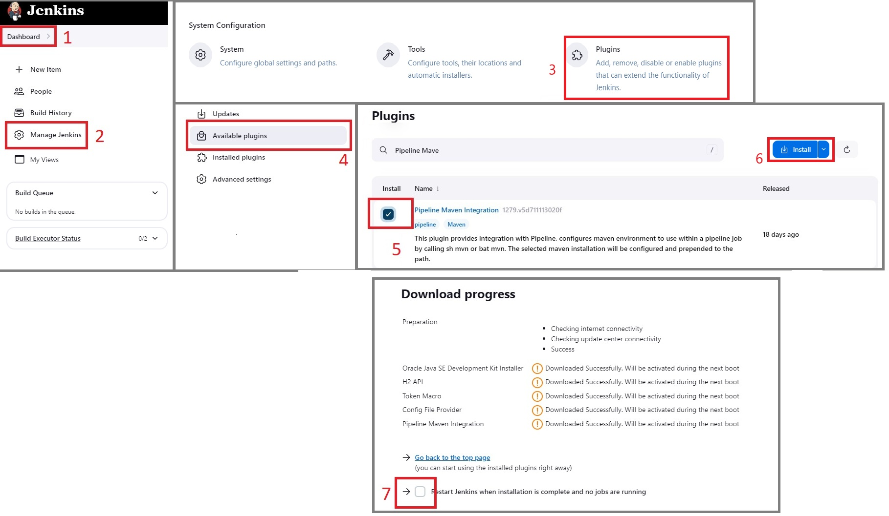
4. Repeat the previous step to install **Maven Integration** plugin
5. Repeat the previous step to install **GitHub** plugin
6. Configure GitHub Plugin
   1. Select **Dashboard**, **Manage Jenkins**, then, **Configure System**. Scroll down to the **GitHub** section. Click **Add GitHub Server** button. Name it **github**. Click **Add** for a credential.
      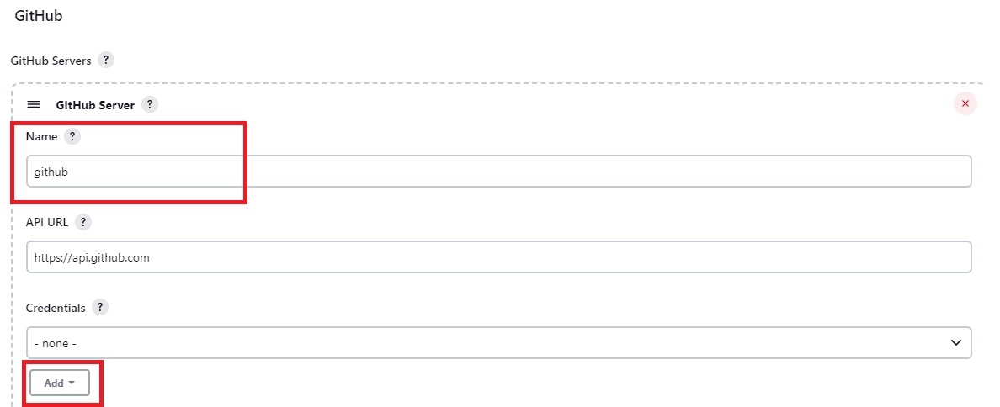
   2. Choose the kind to be **secret text**. Type Github token obtained in step 2 in the **secret** textbox. Set its **ID** to be **GitHub_token**. Finally, click **ADD**.
      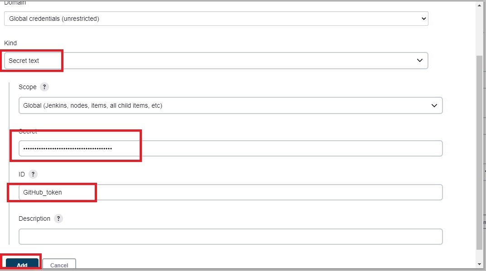
   3. Set the **credential** to **GitHub_token**. Test the connection. Then, click **Save**.
      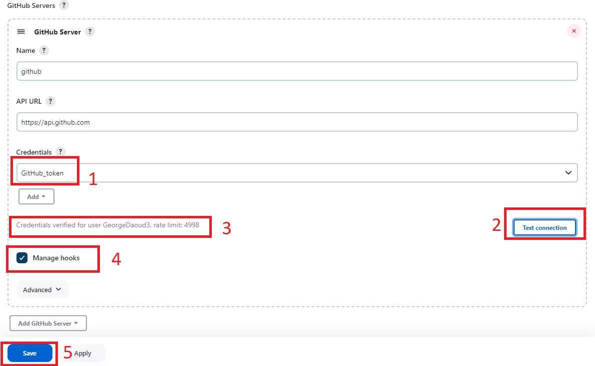
7. Configure Maven Plugin: select **Dashboard**, **Manage Jenkins**, **Global Tool Configuration**, choose **Add Maven**, name it **maven**, choose **Install automatically**, click **save**.
   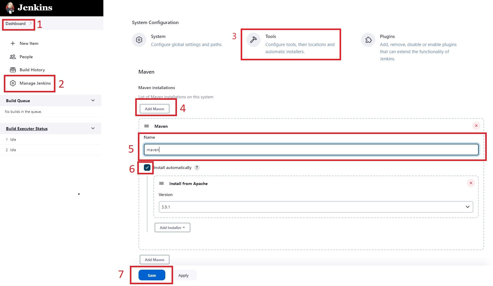
8. Create a Job: select **Dashboard**. Click **create a job**. Name it **binaryCalculate_mvn**, and choose **Maven Project**. Finally, click **Ok**.
   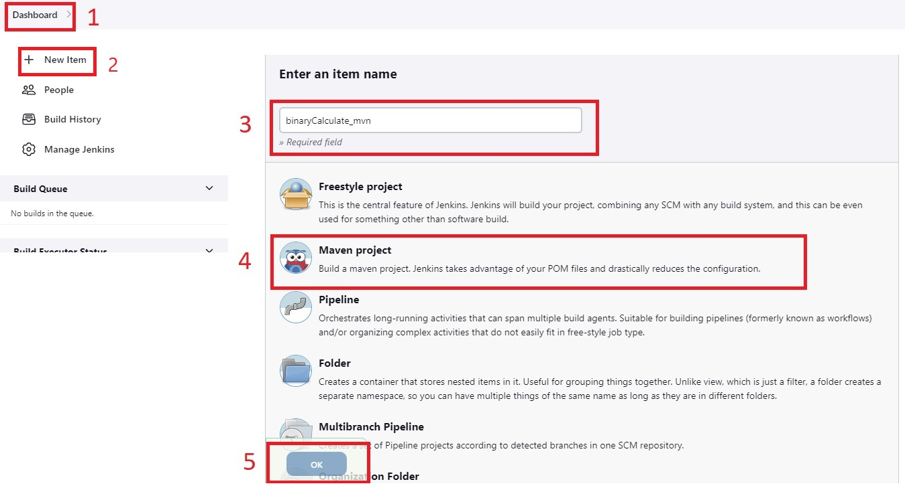
9. Configure the job: The job will automatically pull the repository for each commit. Then, the maven project is built and the status is sent back to the repository to be associative to the commit.
   1. For **Source Code Management**, select **Git**. Fill in the **Repository URL**. Make sure that the **branch** is blank.
      
   2. In **build triggers** section, check **GitHub hook trigger for GITScm polling** to automatically start the job for each new commit to the repository.
      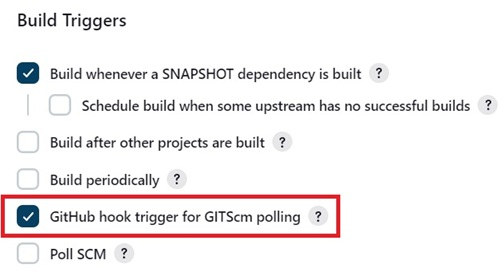
   3. In **build** section, set the path of the **pom** file in the repository and the build options.
      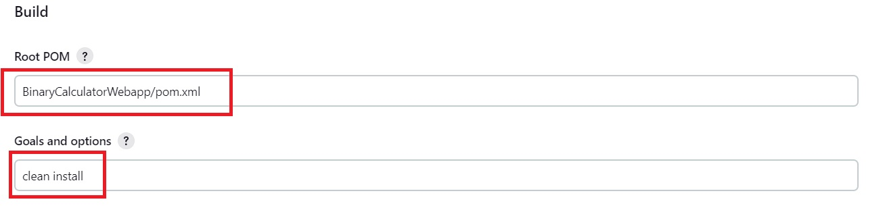
   4. In the **Post-build Actions** section, **set build status on GitHub commit** which will associate the GitHub commit with the status of the Jenkins job.
      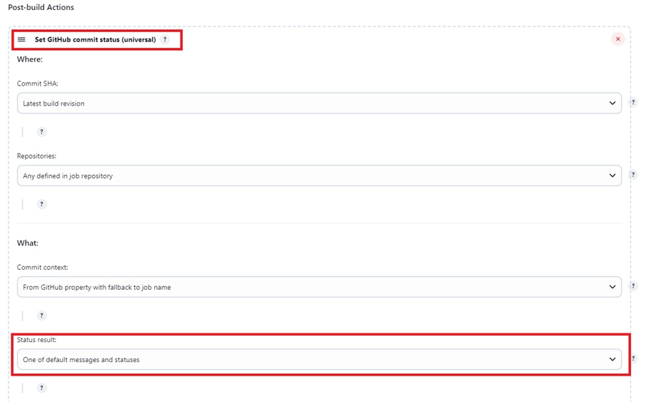
   5. Click **Save**. 
10. To enable Jenkins to automatically start running after each commit, **webhook** has to be configured in the GitHub repository.
   1. Within the repository page in the Github, select **Settings**. Select **Webhooks**. Then, click **Add webhook**.
      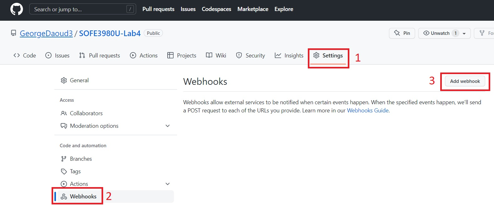
   2. set the **Payload URL** to http://\<jenkinsIP\>:8080/github-webhook/ and the content type to JSON. Then, click **Add webhook**.
      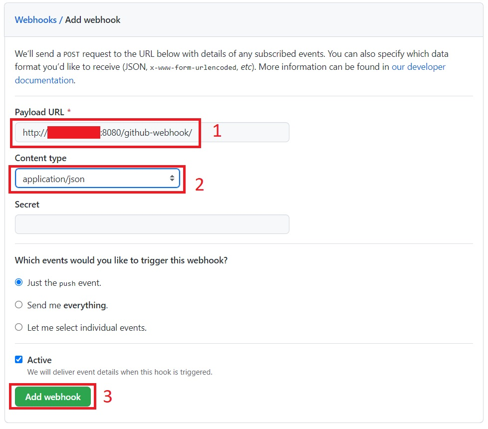
11. Once you commit any changes to the repository (you can change the readme file), the job will start building. 
   1. To check the status of each run or to build it the job manually, navigate to the job page within Jenkins.
      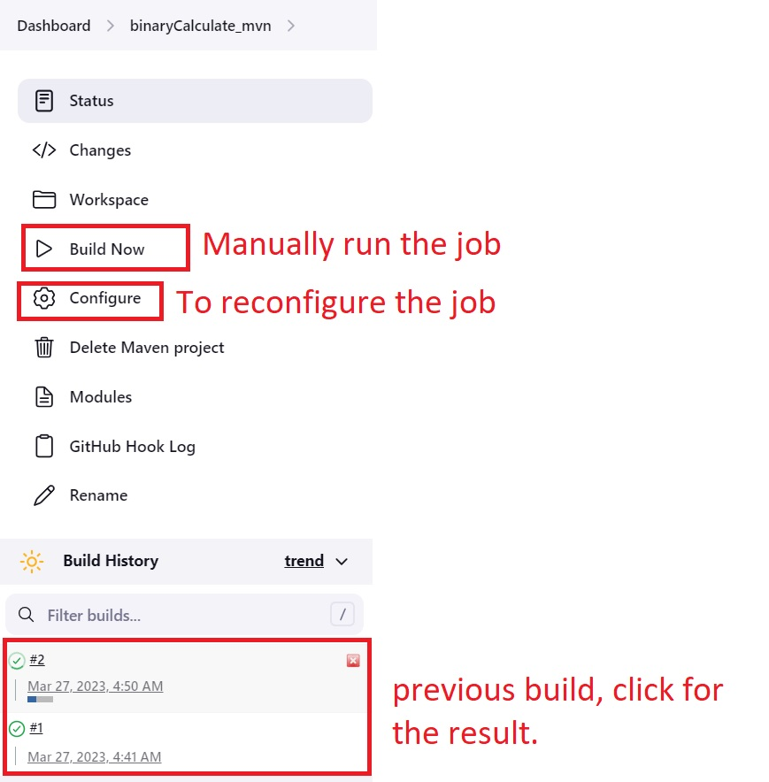
   2. Also, the commit in the GitHub will have a check mark and a link to the Jenkins build report.
      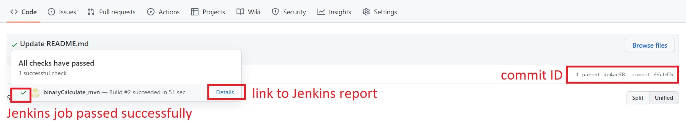

## Create a Jenkins job using a script.
The Other way is to create a customized job by providing a script (**Jenkinsfile**) that contains the description of a pipeline of stages that would be executed. This method is more flexible. The Jenkinsfile already exists in the repository at the path /BinaryCalculatorWebapp/. 
1.	Watch this video about [the pipeline syntax]( https://www.youtube.com/watch?v=pzbrVVy6ul4)
2.	Read the file /BinaryCalculatorWebapp/Jenkinsfile and try to understand 
3.	Select Dashboard. click New Item. Name it BinaryCalculator_pipeline. Choose the type to be Pipeline.
4.	On the configuration page,
   1. In the Build Triggers section, check GitHub hook trigger for GITScm polling.
   2. In the Pipeline section, 
      * Set the **Definition** to **Pipeline script from SCM**.
      * Set the **SCM** to **Git**
      * Set the **Repository URL** to your GitHub link.
      * Set the **Script Path** to /BinaryCalculatorWebapp/Jenkinsfile
      * Set the **branches to build** to \* / \*
5.	As the **webhook** is already configured, it should work automatically when  after each commit. Commit any change to the repository. Then, check that the job is been executed and check its report.

## Discussion:
What do pipeline, node, agent, stage, and steps mean in the context of Jenkins?

## Design:
* Update the Binary Calculator project to the latest version you have implemented. Check that the jobs start running and check their report. 
* Until now, the script in the Jenkins file contains only the continuous integration part. It’s required to update it to continuously deploy to GKE.


## Deliverable
* A report containing both the discussion and design parts.
* Your Github link.
* An audible video of about 3 minutes showing the continuous integration part (the two techniques).
* An audible video of about 3 minutes showing the design part.
